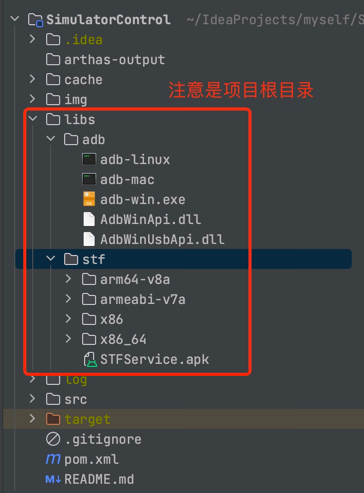
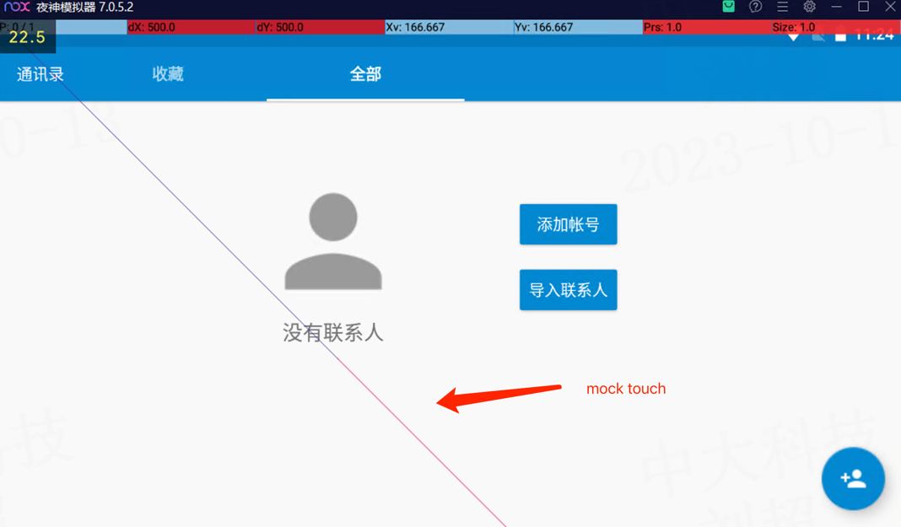
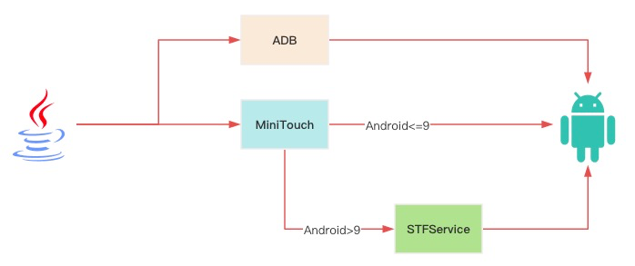

# AndroidTouch

使用Java对Android设备进行模拟点击/触控，支持多平台(Mac、Windows、Linux)，支持多点触控

## 🎉 快速开始

### 1.引入jar包

- 方式一：下载项目自行打包
- 方式二：[下载最新版本：jar包](https://github.com/MyMonsterCat/DeviceTouch/releases)

```xml
<dependency>
    <groupId>com.github.monster</groupId>
  <artifactId>AndroidTouch</artifactId>
  <version>latest.version</version>
</dependency>
```

### 2.添加库文件

在你的项目中新建`/libs`目录，并通过下面的方式添加库文件

- 方式一：下载项目，将源代码`/libs`目录下的`/adb`和`/stf`中的文件复制到自己项目根目录下的`/lib`中
- 方式二：[下载最新版本：lib.zip](https://github.com/MyMonsterCat/DeviceTouch/releases)

完成后如下所示：



### 3.创建安卓设备

- 通过AndroidStudio模拟一个设备
- 通过USB连接你的安卓设备
- PC安装模拟器，如[夜神模拟器](https://www.yeshen.com/)

无论通过哪种方式，请确保开启开发者模式！！！

### 4.启动

#### 4.1 SpringBoot项目

> 此种方式默认使用第一个设备

**yaml添加配置**

```yaml
adb-loader:
  # 通过minitTouch进行触控
  minitTouch-cli: true
  # 不使用原生adb指令
  adb-cli: false
```

**编写代码测试**

```java
public class TestCli {
    @Resource
    private MiniTouchCli minitTouchCli;
  
    @SneakyThrows
    public void attackCityStatistics() {
        minitTouch.swipe(100, 100, 200, 200, 500);
    }
}
```

效果如下



#### 4.2 非springboot项目启动

请参考[测试类](https://github.com/MyMonsterCat/DeviceTouch/tree/main/src/test/java/com/github/monster/touch/config/CliTest.java)
，自行编写

## 🤔 运行流程



### miniTouchCli

- PC通过adb连接安卓设备.

- 安卓版本 > 9

  - 将STFService部署到安卓设备
  - 开启STFService后台运行（创建Socket服务）

- 安卓版本 <= 9

  - 将minitouch部署到安卓设备


- 开启minitouch服务（创建Socket服务）

- PC通过Socket与安卓进行通信，即接收指令，对安卓设备进行操作

### adbCli

- PC通过adb连接安卓设备
- 通过adb对安卓设备进行控制

## 📌 TODO

- [x] 添加**多指触控**操作
- [x] 添加截图、裁剪图片、输入文字功能
- [x] 纳入springboot容器管理
- [x] 适配不同Android版本
- [ ] 识别不同分辨率的设备

## 🗣️ FAQ

### 无法下载ddmlib

在项目根目录[libs/ddmlib](https://github.com/MyMonsterCat/DeviceTouch/tree/main/libs/ddmlib)提供了ddmlib的jar包，自行下载并添加到项目库

## 🙏 鸣谢

- [DeviceFarmer](https://github.com/DeviceFarmer)
- [MinicapAndTouch](https://github.com/bingosam/MinicapAndTouch/fork)
- [STF 框架之 minitouch 工具](https://testerhome.com/topics/4400)

## 🪪 开源许可

使用 [Apache License 2.0](LICENSE)
