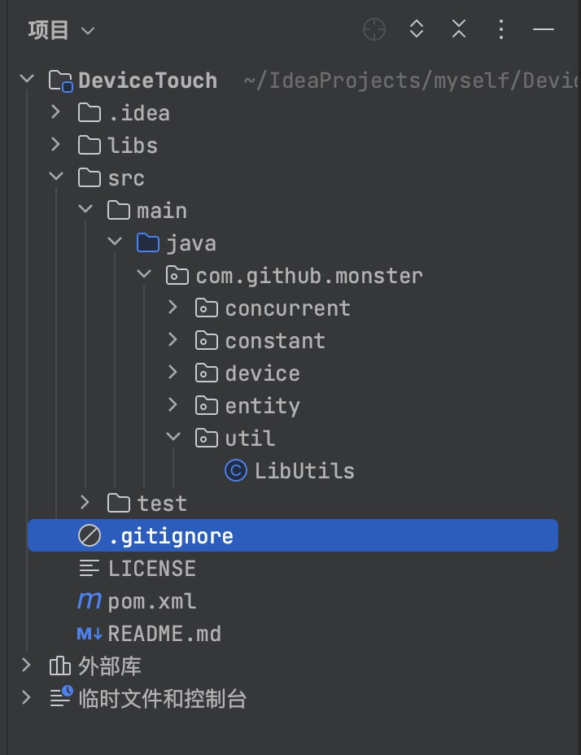
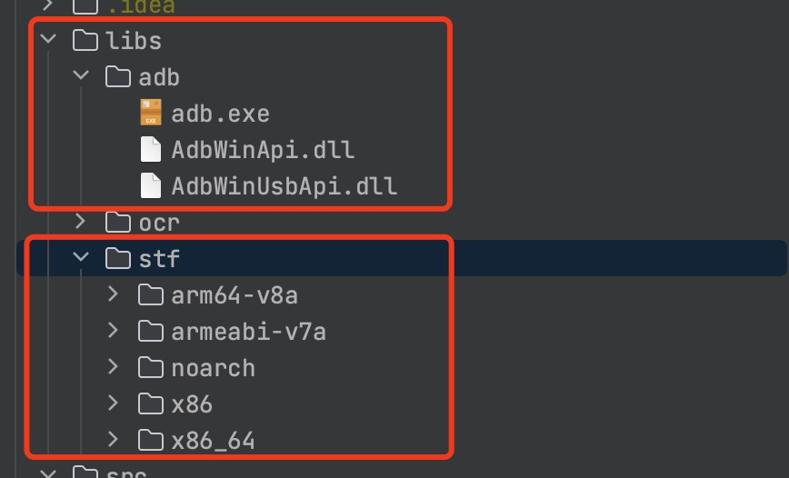
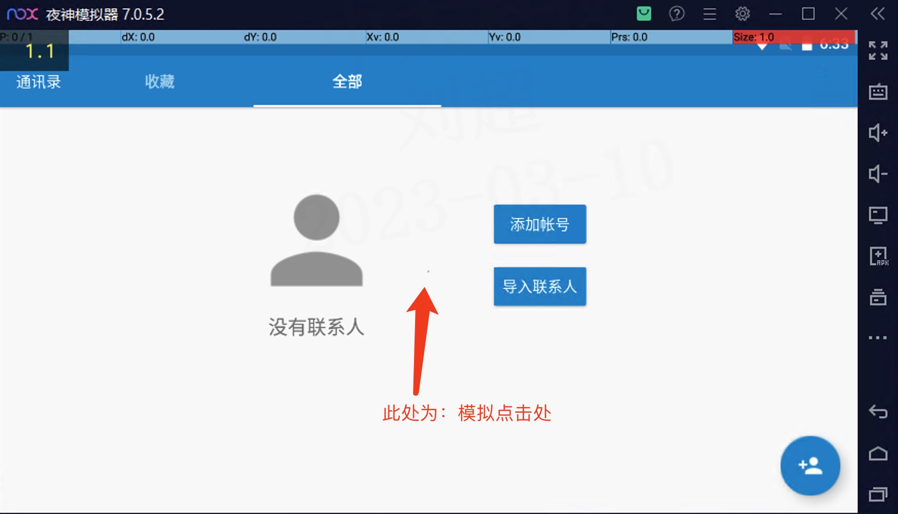

# DeviceTouch

> 本项目参考了[MinicapAndTouch](https://github.com/bingosam/MinicapAndTouch/fork)，在此基础上对其进行了大量重构，并且添加了若干功能，大致为：
>
> - 添加类和文档说明
> - 代码重构，添加类说明，优化日志描述，让阅读源代码更为简单
> - 去除minicap以及stf.apk（**原因：自己项目中暂不需要此功能，不必要的性能浪费，故移除**）
> - 添加**多指触控**操作
> - 添加一些自定义功能（如截图、裁剪图片、输入文字等）
> - 纳入springboot容器管理
> - 识别不同分辨率的设备
> - 其他修改细节请见源码

## 内部流程

- 通过adb连接安卓设备.

- 将minitouch部署到设备上

- 开启minitouch服务

- 接收指令，对安卓设备进行操作

## 使用指引

1.下载项目

> git clone https://github.com/MyMonsterCat/DeviceTouch.git

2.使用编辑器打开项目，等待拉取依赖。此处以IDEA为例：




3.使用maven命令打包至本地仓库

```
mvn clean

mvn install
```

**另一种方式：在项目的 `/libs/jar-pack/`提供了打包好了的jar包，直接使用即可**

4.在你自己的项目中引入坐标

```xml

<dependency>
    <groupId>com.github.monster</groupId>
    <artifactId>device-touch</artifactId>
    <version>0.0.1</version>
</dependency>
```

5.**将源代码`/libs`目录下的`/adb`和`/stf`中的文件复制到自己项目根目录下的`/lib`中**



6.此处以springboot项目为例，编写代码进行测试

```java
@Component
public class TestTap {

    @Resource
    private AdbCli adbCli;
  
    @Resource
    private DeviceCli deviceCli;
    
    @SneakyThrows
    public void tap1(int x, int y) {
        adbCli.down(x, y);
        adbCli.up(x, y);

        System.out.println("被调用啦" + x + "," + y);
    }
  
    @SneakyThrows
    public void tap2(int x, int y) {
        deviceCli.touchDown(x, y);

        deviceCli.touchUp(x, y);

        System.out.println("被调用啦" + x + "," + y);
    }
  
  
}
```

效果如下:



## 使用限制

- [minitouch](https://github.com/DeviceFarmer/minitouch)支持Android9及以下版本
- 仅限在**Windows**上进行使用


## 鸣谢

- [DeviceFarmer](https://github.com/DeviceFarmer)
- [MinicapAndTouch](https://github.com/bingosam/MinicapAndTouch/fork)
- [STF 框架之 minitouch 工具](https://testerhome.com/topics/4400)

## 开源许可

使用 [Apache License 2.0](LICENSE)

Copyright © The bingosam Project. All Rights Reserved.
